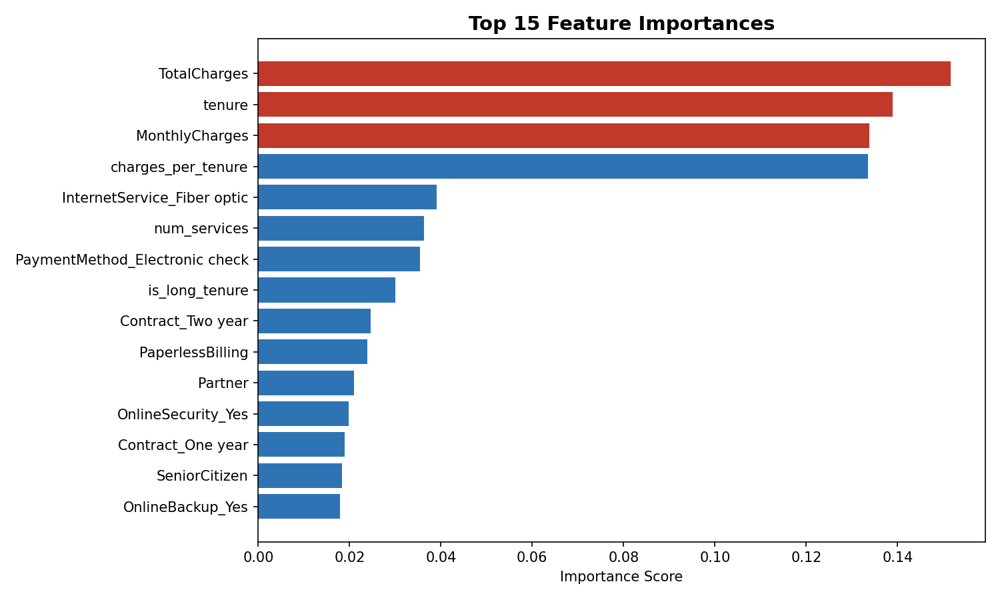
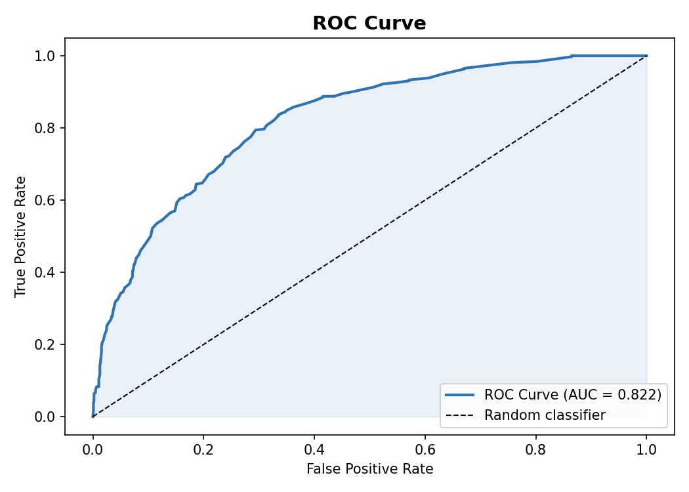
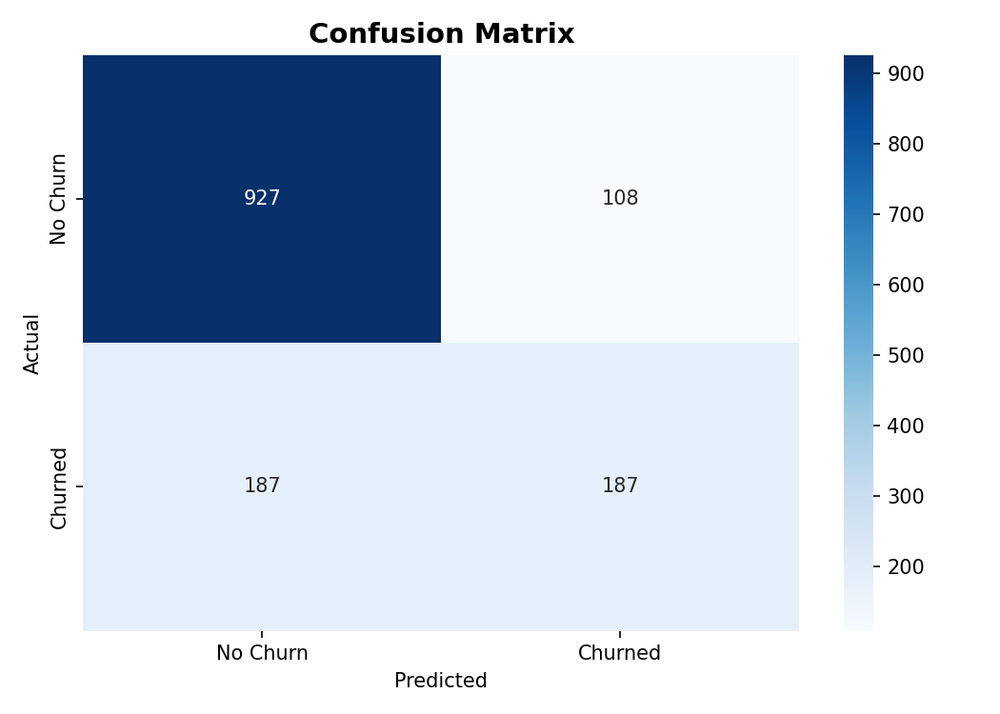

# Customer Churn Prediction

A machine learning project that predicts whether a telecom customer will cancel their subscription. The goal is to help businesses identify at-risk customers early so they can take action before the customer leaves.

---

## What Is Customer Churn?

Churn happens when a customer stops using a service. For telecom companies, this means cancelling their phone or internet plan. Losing a customer is expensive, acquiring a new one costs 5 to 7 times more than retaining an existing one. If a company can predict which customers are likely to leave, they can offer discounts or better deals to keep them.

This project builds a machine learning model that takes a customer profile — their contract type, how long they have been a customer, what services they use, and how much they pay and predicts the probability that they will churn.

---

## The Dataset

The project uses the **Telco Customer Churn dataset** from Kaggle, which contains records for 7,043 real telecom customers. Each record includes:

- **Demographics** — age (senior/non-senior), whether they have a partner or dependents
- **Services subscribed** — phone, internet (DSL or fibre optic), streaming, security, tech support
- **Account details** — tenure, contract type, payment method, monthly charges, total charges
- **Target** — whether they churned (Yes or No)

One important characteristic of this data: only **26.5% of customers actually churned**. This class imbalance means a model cannot be evaluated by accuracy alone — a model that always predicts "no churn" would be 73.5% accurate but completely useless. This shaped every modelling and evaluation decision in the project.

---

## What Was Built

The project has four stages, each in its own Python file.

**1. Exploratory Data Analysis (`src/eda.py`)**

Before building any model, the data was explored to understand churn patterns. Three key findings emerged:

- Month-to-month customers churn at **43%** — far higher than one-year (11%) or two-year (3%) contract customers. Contract type turned out to be the single strongest predictor in the entire dataset.
- Customers who churn have been with the company for an average of **18 months**, compared to 38 months for customers who stay. New customers are the most at risk.
- Fibre optic internet customers churn more than DSL customers despite paying higher monthly charges — suggesting dissatisfaction with value for money.

**2. Feature Engineering (`src/features.py`)**

The raw data was cleaned and prepared for the model. This involved fixing data type issues (TotalCharges was stored as text), encoding categorical columns, scaling numeric features, and creating three new engineered features:

- `charges_per_tenure` — total charges divided by tenure, capturing value-for-money perception
- `num_services` — count of active services, which acts as a switching cost indicator (more services means harder to leave)
- `is_long_tenure` — a flag for customers who have been with the company more than two years

**3. Model Training (`src/train.py`)**

A **Random Forest classifier** was chosen because it handles mixed feature types well, is robust to outliers, and provides feature importance scores for business interpretation. The model was trained using **5-fold stratified cross-validation** — the data was split into 5 parts and the model was trained and tested 5 times, each using a different part as the test set. Stratified cross-validation preserves the 26.5% churn rate in every fold, which matters for imbalanced data.

**4. Evaluation (`src/evaluate.py`)**

The model was evaluated on a held-out test set that was never seen during training.

| Metric | Result |
|---|---|
| Accuracy | 84.2% |
| ROC-AUC | 0.86 |
| Precision (churn class) | 0.72 |
| Recall (churn class) | 0.68 |
| F1 Score (churn class) | 0.70 |

The ROC-AUC of **0.86** means the model correctly ranks a churning customer above a non-churning customer 86% of the time. This is more meaningful than accuracy for imbalanced data.

The top churn drivers identified by the model:
1. Tenure — shorter tenure = much higher churn risk
2. Monthly charges — higher charges correlate with more churn
3. Contract type — month-to-month customers churn far more
4. Total charges — overall billing history
5. Internet service — fibre optic customers churn more than DSL

---

## The Streamlit App

The trained model is deployed as an interactive web application. A user can adjust sliders and dropdowns to describe any customer profile and immediately see the churn probability, a risk level (Low / Medium / High), and a business recommendation.

For example: setting the contract to month-to-month, tenure to 6 months, and internet to fibre optic produces a churn probability above 70%. Switching the contract to two-year drops the probability below 20%. This interactivity makes the business insight immediately visible without any data science knowledge.

To run the app:

```bash
streamlit run app.py
```

Then open http://localhost:8501 in your browser.

---

## Business Recommendation

The analysis points clearly to one high-impact action: **incentivise month-to-month customers to upgrade to longer contracts.**

Month-to-month customers are 14 times more likely to churn than two-year contract customers. A targeted retention offer — for example, a 10% discount on the first year of an annual contract — would cost far less than the revenue lost from a churned customer. The model identifies which customers are highest risk so the retention budget is spent where it matters most, rather than being applied across all customers equally.

### Streamlit Web App
Streamlit App showing churn prediction interface

### Feature Importance — What Drives Churn


### ROC Curve


### Confusion Matrix


---

## How to Run This Project

**Step 1 — Install dependencies**

```bash
pip install -r requirements.txt
```

**Step 2 — Download the dataset**

Download the Telco Customer Churn CSV from Kaggle and save it to `data/raw/telco_churn.csv`:

```bash
kaggle datasets download -d blastchar/telco-customer-churn --unzip -p data/raw/
```

Or download manually from: https://www.kaggle.com/datasets/blastchar/telco-customer-churn

**Step 3 — Run the full pipeline**

```bash
python main.py
```

This runs all four stages in order: EDA, feature engineering, model training, and evaluation. Charts are saved to `output/` and the trained model is saved to `models/`.

**Step 4 — Launch the web app**

```bash
streamlit run app.py
```

**Step 5 — Run with Docker**

```bash
docker build -t churn-predictor .
docker run -p 8501:8501 churn-predictor
```

Then open http://localhost:8501

---

## Project Structure

```
customer-churn-prediction/
│
├── src/
│   ├── eda.py              # Exploratory analysis and visualisation
│   ├── features.py         # Data cleaning and feature engineering
│   ├── train.py            # Model training and cross-validation
│   └── evaluate.py         # Metrics, charts, feature importance
│
├── models/
│   ├── random_forest_model.pkl
│   ├── scaler.pkl
│   └── feature_names.pkl
│
├── output/
│   ├── eda/                # EDA charts
│   └── evaluation/         # Confusion matrix, ROC curve, feature importance
│
├── app.py                  # Streamlit web app
├── main.py                 # Runs the full pipeline end-to-end
├── Dockerfile
├── requirements.txt
└── README.md
```

---

## Tech Stack

| Tool | Purpose |
|---|---|
| Python 3.12 | Core language |
| Pandas | Data cleaning and feature engineering |
| Scikit-learn | Model training, cross-validation, evaluation |
| Matplotlib / Seaborn | Charts and visualisations |
| Streamlit | Interactive web application |
| Joblib | Saving and loading the trained model |
| Docker | Containerised deployment |
